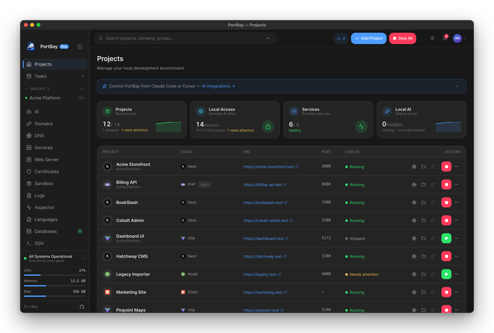
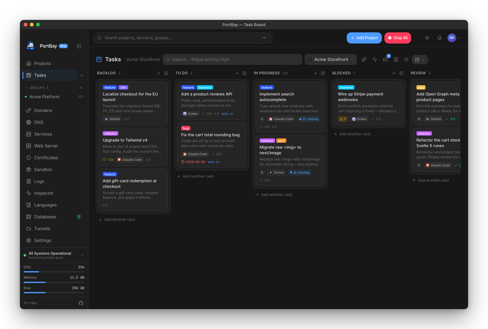
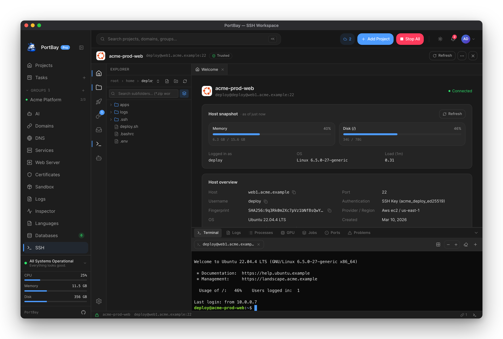
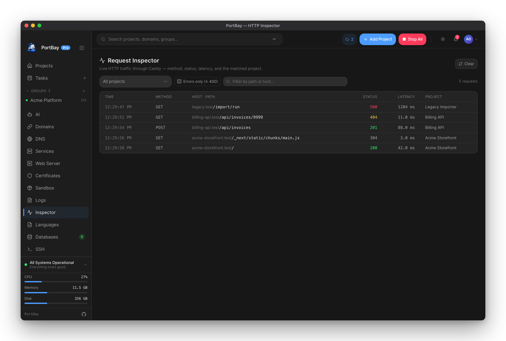
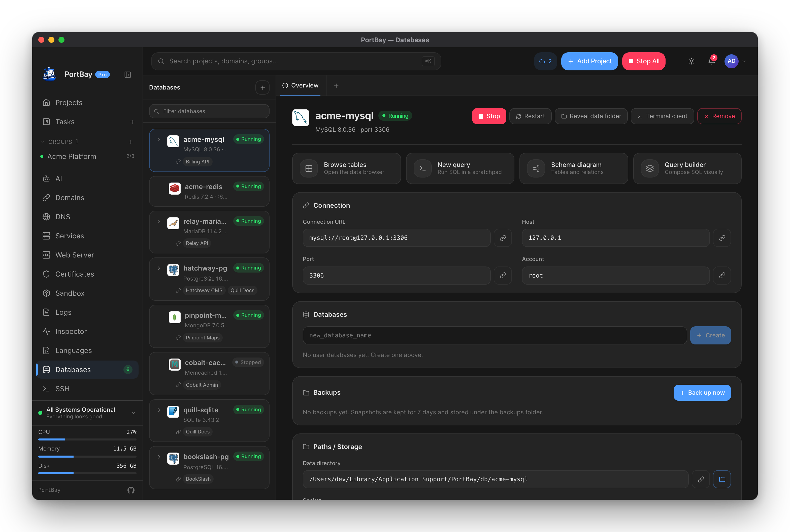
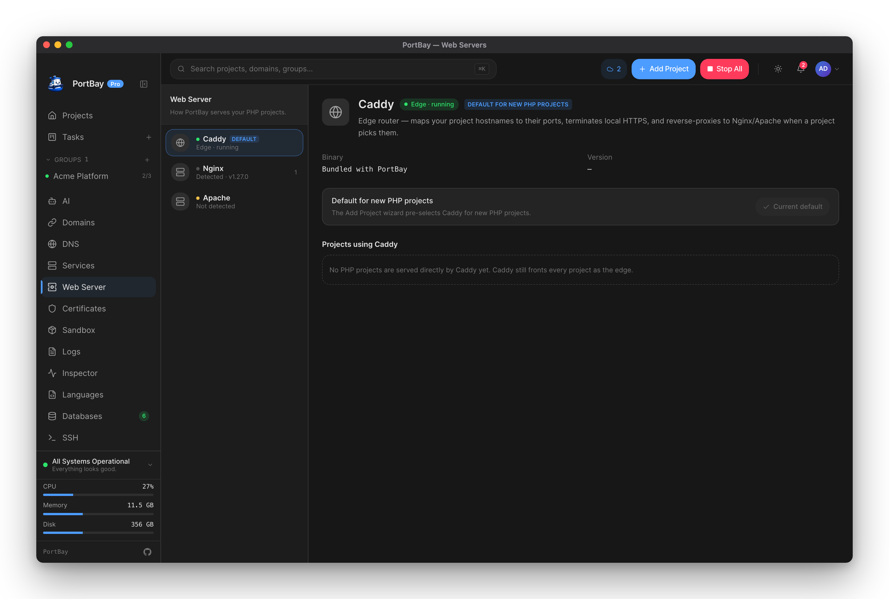
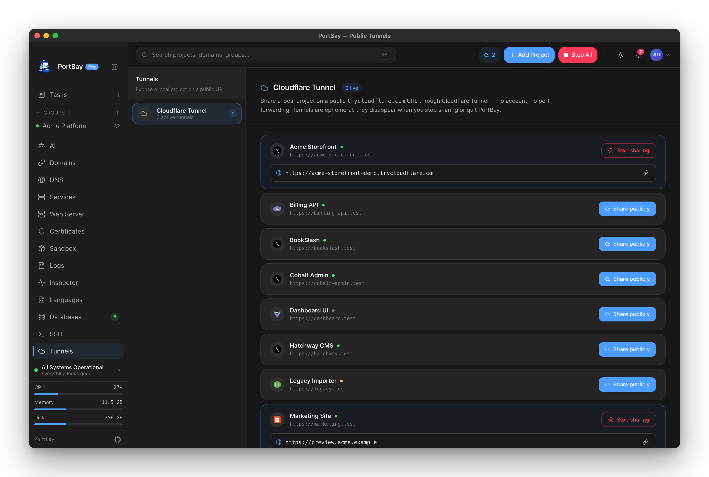
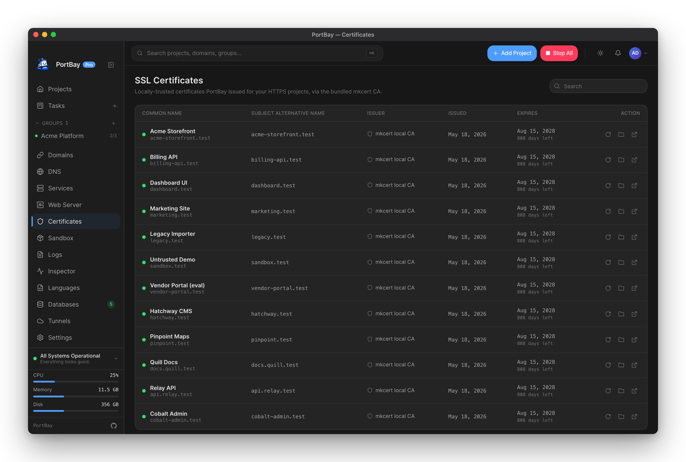
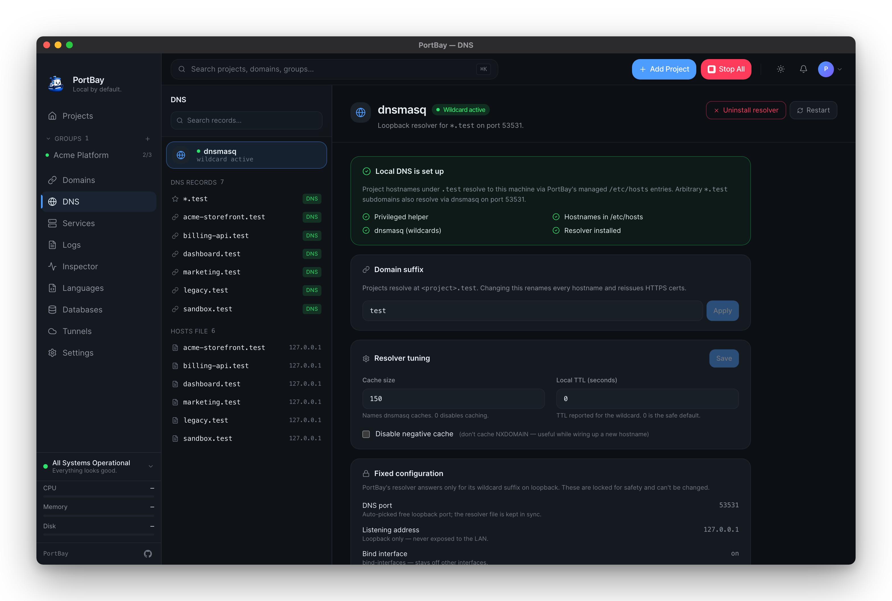

<div align="center">

<h1>
  
  &nbsp;PortBay
</h1>

**The open-source, container-free local development environment manager for macOS.**

One Play button per project. One Stop that always works. Real HTTPS hostnames,
managed DNS, and a reverse proxy you never touch.

And it's the local dev environment your AI coding agents can actually drive: a
per-project task board that hands cards to Claude Code, Codex, Cursor, Gemini, and
more — plus a built-in SSH workspace for the servers those projects ship to.

[Documentation](https://docs.portbay.app) ·
[Architecture](./docs/ARCHITECTURE.md) ·
[Status](#status) ·
[Contributing](./CONTRIBUTING.md)

`macOS` · Built with Tauri 2 · Rust · Svelte 5

[](https://buymeacoffee.com/beiruti)

> **Status:** released for macOS (Apple Silicon). Signed, notarized builds ship
> via DMG and Homebrew — see [Getting started](#getting-started). Linux and
> Windows are on the [roadmap](#roadmap).

</div>

<div align="center">

<a href="https://try.portbay.app"></a>

<sub><b><a href="https://try.portbay.app">▶ Try it in your browser</a></b> — the real interface with sample projects, no install required.</sub>

</div>

## Why PortBay

Running more than one project locally turns your machine into an unmanaged server.
You juggle background processes (`pnpm dev`, `php-fpm`, `vite`, `redis-server`),
fight over ports, hand-edit `/etc/hosts`, mint self-signed certificates, and keep a
reverse proxy alive — then multiply all of that by every project you own. The
result is forgotten processes, port collisions, expired certs, and "it worked
yesterday" mornings.

PortBay treats your machine like a small PaaS. Each project is a declarative
record — a hostname, a start command, a port — and the app owns the rest:
lifecycle, routing, and certificates. Stop the app and every project stops.
Restart one project and the others are untouched.

The design constraint is to stay **native and small**: under 80 MB idle RAM and a
sub-30 MB installer, so it sits next to your editor and browser without being noticed.

## What it does

- **Point it at a folder — it already knows the project.** PortBay reads the framework (Next.js, Vite, plain Node, PHP, Laravel, Python) and fills in the start command, port, hostname, and HTTPS. Nothing to configure by hand before the first run.
- **One-click Play / Stop per project** — start and stop a project without hunting for the right terminal tab.
- **A universal Stop-All** kill switch that always works, even after a crash.
- **Real HTTPS hostnames** like `https://myproject.test`, issued and trusted locally.
- **Wildcard `.test` routing** via a bundled DNS resolver — no per-project hosts edits.
- **Reverse-proxy routing** managed for you through [Caddy](https://caddyserver.com)'s admin API.
- **Bundled databases** — PortBay-supervised MySQL, MariaDB, Postgres, Redis, MongoDB, and Memcached.
- **Public sharing** — expose any project over a [Cloudflare](https://www.cloudflare.com/products/tunnel/) tunnel with one click.
- **A built-in SSH workspace** — save your remote hosts and get an interactive terminal, an SFTP file browser with inline editing, local/reverse/SOCKS port-forward tunnels, and live processes/ports panels — for the servers your projects ship to, without opening a separate SSH app.
- **A sandboxed runner** — run an untrusted or freshly-cloned project inside a macOS sandbox, inspect it, then promote it to a normal local run.
- **An MCP server** — drive your whole local stack from Claude Code, Cursor, or Zed; PortBay's projects and actions are exposed as 69 agent tools.
- **A task board your agents work** — every project gets a Kanban board whose cards are Markdown in your repo. Move a card to *To Do* and the coding agent you assigned — Claude Code, Codex, Cursor, Gemini, Aider, and more — picks it up, does the work, and writes a handoff note for the next run.
- **A declarative registry** — projects live in JSON; the daemon reconciles reality to match.
- **Live logs, status, and metrics** per project, plus a macOS menu-bar mode.
- **Already using Herd, ServBay, or MAMP?** Import your existing sites in one step — no re-entering paths, ports, and PHP versions.

Everything is driven by a Rust core with full CLI parity, so the GUI — and your
AI agent — are clients, not the source of truth.

## A task board your AI agents actually work

Every project in PortBay gets a board. The cards are plain Markdown files inside
your repo (`.portbay/tasks/`), so they version with your code and stay readable
with or without PortBay.

Move a card to **To Do** and the agent you assigned picks it up and starts
working — in your project, on your machine. PortBay launches the coding agent you
already have installed; it never runs a model of its own. Claude Code, Codex,
Cursor, Gemini, Aider, Copilot, OpenCode, Amp, Qwen, and Antigravity are
recognised out of the box, and you can point it at any other CLI.

<div align="center">



</div>

- **Assign per card, or set a board default.** Auto-dispatch the moment a card hits *To Do*, or require a click to confirm each run.
- **A handoff doc that travels with the work.** When a run ends it appends to `.portbay/HANDOFF.md` — a short, newest-first brief the next run (or the next person) reads to continue without re-deriving context.
- **It stays out of trouble.** A card can be blocked on others until they land, an optional *Review* column holds agent-"done" work for a human to approve, and runs whose process dies are reclaimed automatically.
- **One board, three front ends.** The GUI, the `portbay` CLI, and the MCP server read and write the same cards — so an agent connected over MCP can claim the next card, record the files it touched, and move it to *Review* or *Done*, all through PortBay's agent tools.

## A full SSH workspace, in the same app

The projects you run locally have to ship somewhere. PortBay gives you a real SSH
client for the servers on the other end — saved hosts, a terminal, files, and
tunnels — so you don't keep a second app open just to reach them.

Save a connection once and open a workspace for it: an interactive terminal, an
SFTP file browser with an inline code editor (open a remote file, edit, ⌘S), and
port-forward tunnels you start and stop with a click — with live processes and
listening-ports panels read straight off the host.

<div align="center">



</div>

- **Saved hosts with the details that matter.** Key, password, or `ssh-agent` auth; proxy-jump through a bastion; per-host environment and stage tags; and a one-look health probe with latency and host-key trust.
- **Tunnels without memorising flags.** Forward a remote database to `localhost`, expose a local service back to a server, or open a SOCKS proxy — local, reverse, and dynamic forwards, kept alive and reconnected for you.
- **Edit and deploy in place.** Browse the remote filesystem, open a file in the built-in editor, run a saved deploy step list, or drop into the terminal — all on the connection you already opened.
- **An agent on the box, when it's there.** If a host runs Ollama, PortBay can talk to it — a small on-host assistant that only ever runs the commands you approve.

## A look around

|  |  |
| :--: | :--: |
| **HTTP request inspector** — live Caddy traffic | **Bundled databases** — MySQL, MariaDB, Postgres, Redis |
|  |  |
| **Web servers** — per-project Caddy routes | **Public tunnels** — share over Cloudflare |
|  |  |
| **Certificates** — locally-trusted HTTPS | **Local DNS** — wildcard `.test` resolution |
|  |  |

## How it compares

PortBay is not the first local-dev manager. It's the open-source, container-free,
native one — and the only one that ships a per-project AI agent task board and a
full SSH/SFTP workspace in the same app.

| | PortBay | Laravel Herd | ServBay | Docker / OrbStack |
|---|---|---|---|---|
| Open source | ✅ AGPL-3.0 | ❌ | ❌ | Engine ✅ / app ❌ |
| Price | Free · optional Pro | Free / paid Pro | Free / paid | Free / paid |
| Container-free | ✅ | ✅ | ✅ | ❌ |
| Local HTTPS + `.test` | ✅ | ✅ | ✅ | Manual |
| Multi-runtime (Node/PHP/Python) | ✅ | PHP-first | ✅ | ✅ |
| AI agent task board | ✅ | ❌ | ❌ | ❌ |
| Built-in SSH / SFTP / tunnels | ✅ | ❌ | ❌ | ❌ |
| Idle footprint | Small (native) | Small | Medium | Large |
| Cross-platform | macOS (Linux/Windows planned) | macOS/Windows | macOS/Windows | All |

If you live in PHP on macOS today, Herd is excellent. PortBay's bet is a single
open, lightweight tool that handles mixed Node/PHP/static stacks without a daemon
zoo. It's free and open source (AGPL-3.0); an optional
[Pro tier](https://docs.portbay.app/pro/) ($59/yr, or earned by merging a pull
request) funds the project and unlocks hosted multi-device sync and a few
power-user features. Nothing you can't build yourself.

For head-to-head breakdowns, see the in-depth comparisons — PortBay vs
[Laravel Herd](https://docs.portbay.app/comparisons/portbay-vs-laravel-herd),
[ServBay](https://docs.portbay.app/comparisons/portbay-vs-servbay),
[MAMP](https://docs.portbay.app/comparisons/portbay-vs-mamp),
[Docker](https://docs.portbay.app/comparisons/portbay-vs-docker),
[Valet](https://docs.portbay.app/comparisons/portbay-vs-laravel-valet),
[DDEV](https://docs.portbay.app/comparisons/portbay-vs-ddev), and
[Local](https://docs.portbay.app/comparisons/portbay-vs-local).

## How it works

```
GUI (Tauri + Svelte)
  └─ Tauri IPC → PortBay Core (Rust)
                   ├─ Process Compose  — manages your dev processes
                   ├─ Caddy            — reverse proxy (admin API for live routes)
                   ├─ dnsmasq          — wildcard *.test resolution
                   ├─ mkcert           — locally-trusted HTTPS certificates
                   └─ Hosts file       — managed entries via a privileged helper
```

The full design is in [`docs/ARCHITECTURE.md`](./docs/ARCHITECTURE.md); the UX
principles are in [`docs/UX_DESIGN.md`](./docs/UX_DESIGN.md).

## Getting started

PortBay ships as a signed, notarized macOS app for Apple Silicon (macOS 11+).

**Install with Homebrew:**

```bash
brew tap portbay-app/portbay
brew install --cask portbay
```

**Or download the DMG:** grab the latest `PortBay-macos-arm64.dmg` from the
[releases page](https://github.com/portbay-app/portbay/releases/latest), open it,
and drag **PortBay.app** into Applications. Full install notes — uninstall,
requirements, and Gatekeeper details — are in the
[install guide](https://docs.portbay.app/getting-started/install).

### Run from source

For contributors, or anyone who'd rather build it themselves.

**Prerequisites:** [Rust](https://rustup.rs), [pnpm](https://pnpm.io), and the
Xcode command-line tools.

```bash
git clone https://github.com/portbay-app/portbay.git
cd portbay
pnpm install

# Fetch the platform-specific sidecar binaries (large, so not committed):
./scripts/fetch-caddy.sh
./scripts/fetch-mkcert.sh
./scripts/fetch-mailpit.sh
./scripts/fetch-cloudflared.sh
./scripts/fetch-dnsmasq.sh

pnpm tauri dev
```

Re-run a fetch script after bumping the version constant inside it. On a fresh
clone, `pnpm tauri dev` will not start until the sidecar binaries are in place.

## Documentation

The documentation site is built with [VitePress](https://vitepress.dev) and lives
in [`docs-site/`](./docs-site) — install, first run, project setup, CLI reference,
registry schema, troubleshooting, and migration guides from Herd / ServBay / MAMP.

```bash
pnpm docs:dev      # local preview
pnpm docs:build
```

## Status

PortBay is released and in active use on macOS (Apple Silicon). Most of what
follows is already shipped — not planned.

- **Core** — registry, reconciler, Process Compose + Caddy adapters, hosts manager, full CLI. *Shipped.*
- **GUI** — projects, lifecycle, logs, metrics, certificates, web servers, tunnels, DNS, databases, languages/runtimes, HTTP inspector, sandboxed runner, Mailpit, an SSH workspace (terminal, SFTP, port-forward tunnels), and one-step import from Herd / ServBay / MAMP. *Shipped.*
- **AI & automation** — an MCP server (69 tools) plus stack recipes drive the whole stack from Claude Code, Cursor, or Zed, and a per-project task board hands cards to the coding agent of your choice. *Shipped.*
- **Release** — signed & notarized DMG, Homebrew cask, and in-app auto-update. *Shipped.*

### On the roadmap

- **More platforms** — Apple Silicon today; Intel and Linux next, then Windows.

## Contributing

PortBay is early but open. Issues and discussions are welcome now — bug reports,
ideas, and feedback on the architecture all help. Code contributions are opening up
as the public API stabilizes; see [`CONTRIBUTING.md`](./CONTRIBUTING.md) for how to
get involved, and [`CODE_OF_CONDUCT.md`](./CODE_OF_CONDUCT.md) for the ground rules.

If PortBay is useful to you, starring the repo genuinely helps it reach other developers.

## Support the project

PortBay is free and open source (AGPL-3.0). Sponsorships fund the things open source still
has to pay for — a code-signing certificate, build infrastructure, and maintainer
time — and keep the project independent. If your team relies on it, please consider
[sponsoring](https://github.com/sponsors/portbay-app).

## Editions

**PortBay Community** — this repository — is the open-source local development
manager for individuals and teams who want a clean, transparent way to run
projects locally. It is fully usable offline, with no account and no network.

**PortBay Pro** is developed separately and may include team sync,
cloud backups, remote access, hosted recipes, billing, organization management,
enterprise policy controls, and managed infrastructure. It builds on the
Community app through documented public APIs — the Community edition is never
crippled to upsell it, and this repository contains no proprietary Pro
code. See [Community vs Pro](./docs/pages/community-vs-pro.md) and the
[repo boundaries](./docs/architecture/repo-boundaries.md).

## License

PortBay Community is licensed under the **GNU Affero General Public License v3.0
only** ([`AGPL-3.0-only`](./LICENSE)) — you may use, study, modify, and share it,
and if you distribute it or run a modified version as a network service, the
AGPL's terms apply. PortBay Pro is separate commercial software.

- Plain-English summary: [docs/pages/license.md](./docs/pages/license.md)
- License map and policy: [docs/legal/licensing.md](./docs/legal/licensing.md)
- Third-party components: [`NOTICE`](./NOTICE)

SPDX-License-Identifier: `AGPL-3.0-only` · © PortBay contributors.
*This is a summary, not legal advice — the [`LICENSE`](./LICENSE) file is binding.*

## Security & conduct

- Report vulnerabilities privately — see [`SECURITY.md`](./SECURITY.md). Do not
  open public issues for security problems.
- Participation is governed by the [Code of Conduct](./CODE_OF_CONDUCT.md).
- Project decision-making is described in [`GOVERNANCE.md`](./GOVERNANCE.md).
