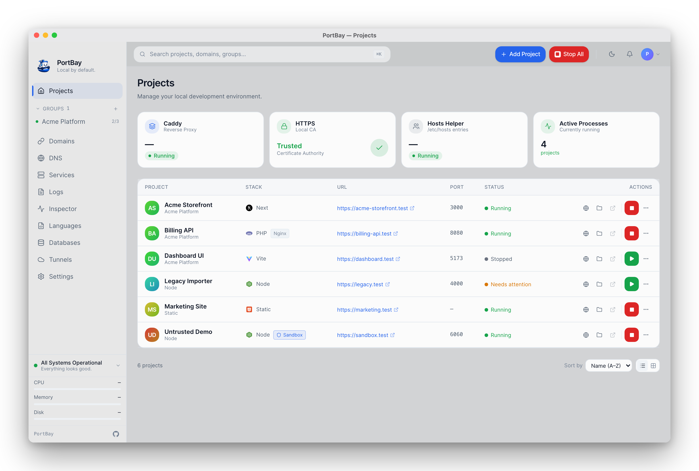
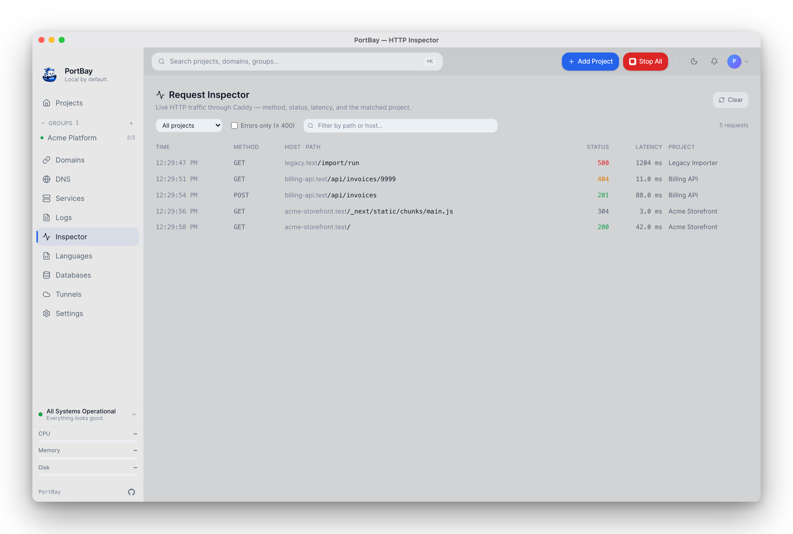
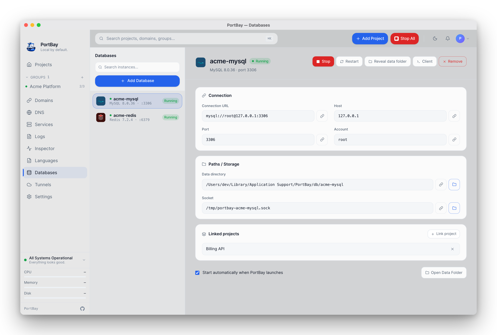
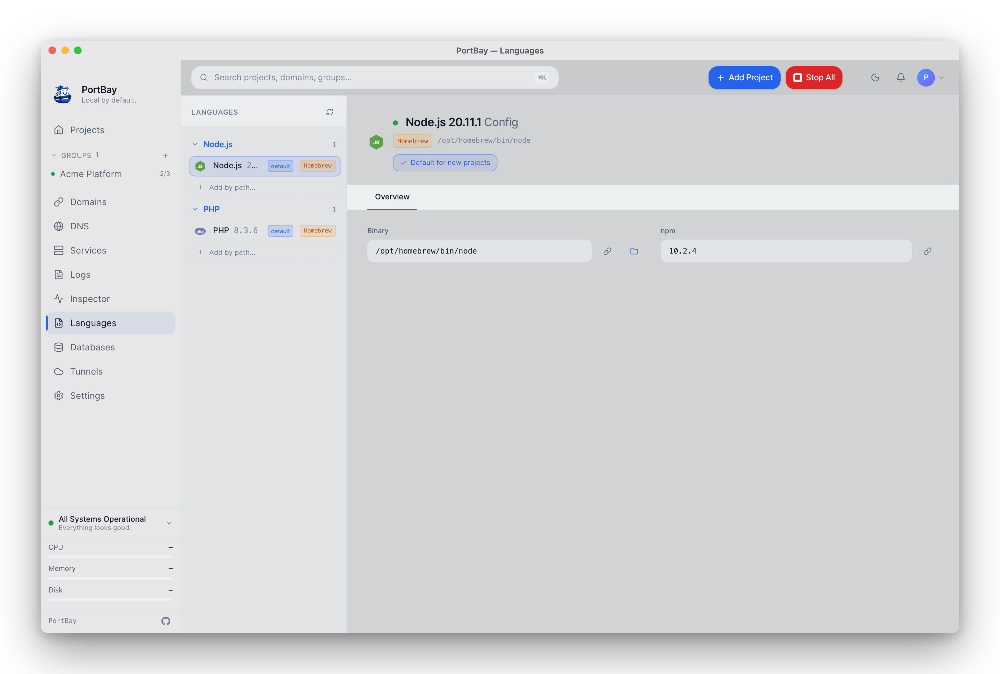
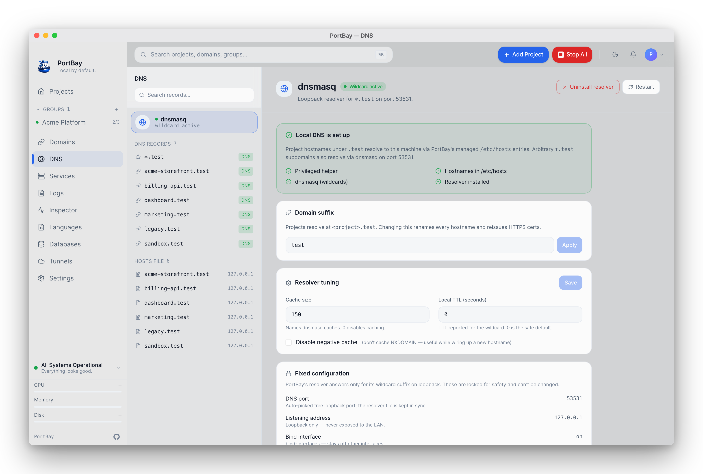

<div align="center">


# PortBay

**A lightweight, open-source manager for your local development environment.**

One Play button per project. One Stop that always works. Real HTTPS hostnames,
no container stack, no hand-rolled proxy and DNS config.

[Documentation](https://portbay-app.github.io/portbay/) ·
[Architecture](./docs/ARCHITECTURE.md) ·
[Roadmap](#roadmap) ·
[Contributing](./CONTRIBUTING.md)

`macOS` · Built with Tauri 2 · Rust · Svelte 5

> **Status:** pre-1.0, in active development. The core runs; binaries and a
> general-use release are on the way. See the [roadmap](#roadmap).

</div>

<div align="center">

<a href="https://try.portbay.app"></a>

<sub><b><a href="https://try.portbay.app">▶ Try it in your browser</a></b> — the real interface with sample projects, no install required.</sub>

</div>

## Why PortBay

Running more than one project locally turns your machine into an unmanaged server.
You juggle background processes (`pnpm dev`, `php-fpm`, `vite`, `redis-server`),
fight over ports, hand-edit `/etc/hosts`, mint self-signed certificates, and keep a
reverse proxy alive — then multiply all of that by every project you own. The
result is forgotten processes, port collisions, expired certs, and "it worked
yesterday" mornings.

PortBay treats your machine like a small PaaS. Each project is a declarative
record — a hostname, a start command, a port — and the app owns the rest:
lifecycle, routing, and certificates. Stop the app and every project stops.
Restart one project and the others are untouched.

The design constraint is to stay **native and small**: under 80 MB idle RAM and a
sub-30 MB installer, so it sits next to your editor and browser without being noticed.

## What it does

- **One-click Play / Stop per project** — Next.js, Vite, plain Node, PHP, Laravel.
- **A universal Stop-All** kill switch that always works, even after a crash.
- **Real HTTPS hostnames** like `https://myproject.test`, issued and trusted locally.
- **Wildcard `.test` routing** via a bundled DNS resolver — no per-project hosts edits.
- **Reverse-proxy routing** managed for you through [Caddy](https://caddyserver.com)'s admin API.
- **A declarative registry** — projects live in JSON; the daemon reconciles reality to match.
- **Live logs, status, and metrics** per project, plus a macOS menu-bar mode.

Everything is driven by a Rust core with full CLI parity, so the GUI is a client,
not the source of truth.

## A look around

|  |  |
| :--: | :--: |
| **HTTP request inspector** — live Caddy traffic | **Bundled databases** — MySQL, Postgres, Redis |
|  |  |
| **Languages** — detect-first runtimes | **Local DNS** — wildcard `.test` resolution |
|  |  |

## How it compares

PortBay is not the first local-dev manager. It is the open-source, container-free,
native one.

| | PortBay | Laravel Herd | ServBay | Docker / OrbStack |
|---|---|---|---|---|
| Open source | ✅ AGPL-3.0 | ❌ | ❌ | Engine ✅ / app ❌ |
| Price | Free · optional Pro | Free / paid Pro | Free / paid | Free / paid |
| Container-free | ✅ | ✅ | ✅ | ❌ |
| Local HTTPS + `.test` | ✅ | ✅ | ✅ | Manual |
| Multi-runtime (Node/PHP/…) | ✅ | PHP-first | ✅ | ✅ |
| Idle footprint | Small (native) | Small | Medium | Large |
| Cross-platform | macOS (Linux/Windows planned) | macOS/Windows | macOS/Windows | All |

If you live in PHP on macOS today, Herd is excellent. PortBay's bet is a single
open, lightweight tool that handles mixed Node/PHP/static stacks without a daemon
zoo. It's free and open source (AGPL-3.0); an optional, pay-what-you-want
[Pro tier](https://docs.portbay.app/pro/) — earned with a donation **or** a merged
pull request — funds the project and unlocks hosted multi-device sync and a few
power-user features. No subscription, and nothing you can't build yourself.

## How it works

```
GUI (Tauri + Svelte)
  └─ Tauri IPC → PortBay Core (Rust)
                   ├─ Process Compose  — manages your dev processes
                   ├─ Caddy            — reverse proxy (admin API for live routes)
                   ├─ dnsmasq          — wildcard *.test resolution
                   ├─ mkcert           — locally-trusted HTTPS certificates
                   └─ Hosts file       — managed entries via a privileged helper
```

The full design is in [`docs/ARCHITECTURE.md`](./docs/ARCHITECTURE.md); the UX
principles are in [`docs/UX_DESIGN.md`](./docs/UX_DESIGN.md).

## Getting started

A signed, downloadable build is coming with the first tagged release. Until then,
run it from source.

**Prerequisites:** [Rust](https://rustup.rs), [pnpm](https://pnpm.io), and the
Xcode command-line tools.

```bash
git clone https://github.com/portbay-app/portbay.git
cd portbay
pnpm install

# Fetch the platform-specific sidecar binaries (large, so not committed):
./scripts/fetch-caddy.sh
./scripts/fetch-mkcert.sh
./scripts/fetch-mailpit.sh
./scripts/fetch-cloudflared.sh
./scripts/fetch-dnsmasq.sh

pnpm tauri dev
```

Re-run a fetch script after bumping the version constant inside it. On a fresh
clone, `pnpm tauri dev` will not start until the sidecar binaries are in place.

## Documentation

The documentation site is built with [VitePress](https://vitepress.dev) and lives
in [`docs-site/`](./docs-site) — install, first run, project setup, CLI reference,
registry schema, troubleshooting, and migration guides from Herd / ServBay / MAMP.

```bash
pnpm docs:dev      # local preview
pnpm docs:build
```

## Roadmap

- **Core** — registry, reconciler, Process Compose + Caddy adapters, hosts manager, CLI. *Working.*
- **GUI** — dashboard, project lifecycle, logs, metrics, certificates, DNS, databases. *In progress.*
- **Release** — signed/notarized DMG, auto-update, first tagged version. *Next.*
- **Platforms** — Intel + Linux, then Windows.

## Contributing

PortBay is early but open. Issues and discussions are welcome now — bug reports,
ideas, and feedback on the architecture all help. Code contributions are opening up
as the public API stabilizes; see [`CONTRIBUTING.md`](./CONTRIBUTING.md) for how to
get involved, and [`CODE_OF_CONDUCT.md`](./CODE_OF_CONDUCT.md) for the ground rules.

If PortBay is useful to you, starring the repo genuinely helps it reach other developers.

## Support the project

PortBay is free and open source (AGPL-3.0). Sponsorships fund the things open source still
has to pay for — a code-signing certificate, build infrastructure, and maintainer
time — and keep the project independent. If your team relies on it, please consider
[sponsoring](https://github.com/sponsors/portbay-app).

## Editions

**PortBay Community** — this repository — is the open-source local development
manager for individuals and teams who want a clean, transparent way to run
projects locally. It is fully usable offline, with no account and no network.

**PortBay Cloud and Pro** are developed separately and may include team sync,
cloud backups, remote access, hosted recipes, billing, organization management,
enterprise policy controls, and managed infrastructure. They build on the
Community app through documented public APIs — the Community edition is never
crippled to upsell them, and this repository contains no proprietary Cloud/Pro
code. See [Community vs Pro](./docs/pages/community-vs-pro.md) and the
[repo boundaries](./docs/architecture/repo-boundaries.md).

## License

PortBay Community is licensed under the **GNU Affero General Public License v3.0
only** ([`AGPL-3.0-only`](./LICENSE)) — you may use, study, modify, and share it,
and if you distribute it or run a modified version as a network service, the
AGPL's terms apply. PortBay Cloud/Pro is separate commercial software.

- Plain-English summary: [docs/pages/license.md](./docs/pages/license.md)
- License map and policy: [docs/legal/licensing.md](./docs/legal/licensing.md)
- Third-party components: [`NOTICE`](./NOTICE)

SPDX-License-Identifier: `AGPL-3.0-only` · © PortBay contributors.
*This is a summary, not legal advice — the [`LICENSE`](./LICENSE) file is binding.*

## Security & conduct

- Report vulnerabilities privately — see [`SECURITY.md`](./SECURITY.md). Do not
  open public issues for security problems.
- Participation is governed by the [Code of Conduct](./CODE_OF_CONDUCT.md).
- Project decision-making is described in [`GOVERNANCE.md`](./GOVERNANCE.md).
