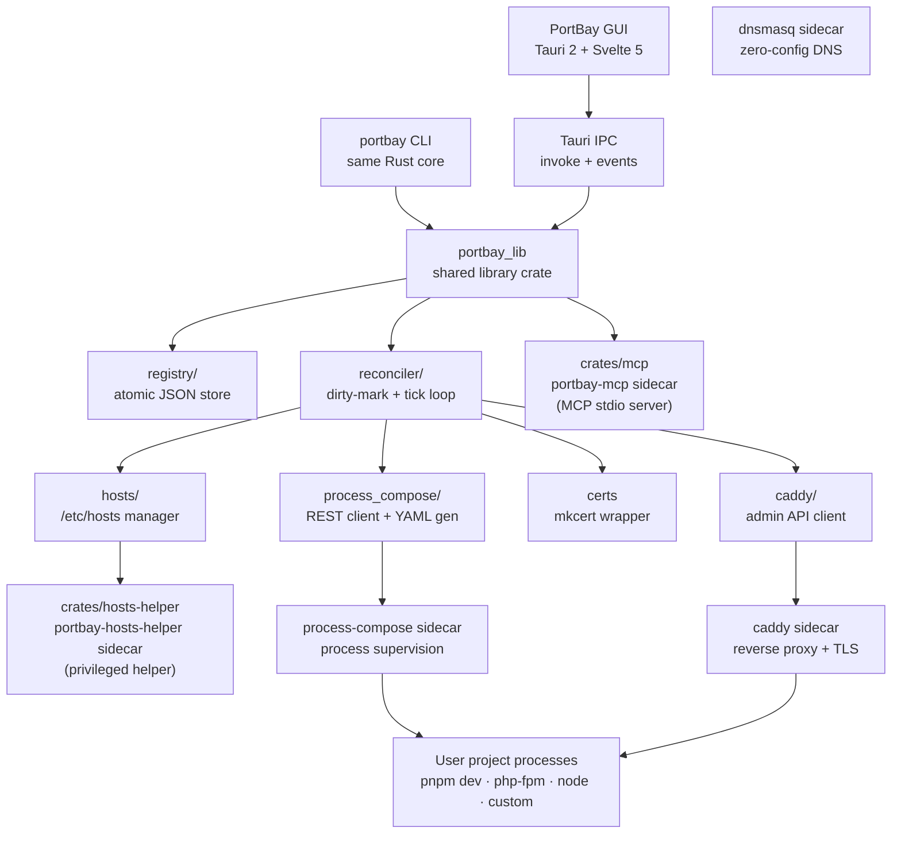

# Architecture

PortBay is a native local development control plane built with Tauri 2, Rust, Svelte 5, Process Compose, Caddy, and mkcert.

## Component Choices

| Component | Choice | Reason |
| --- | --- | --- |
| Desktop shell | Tauri 2 | Small installer, Rust-native core, cross-platform path. |
| Frontend | Svelte 5 + Tailwind 4 | Compiler-first reactivity and low runtime overhead. |
| Core language | Rust | Single binary, strong process-control ergonomics, Tauri-native. |
| Process daemon | Process Compose | Mature process supervision, health checks, logs, REST API. |
| Reverse proxy | Caddy 2 | Runtime admin API, HTTPS-first model, simpler config than nginx. |
| Local TLS | mkcert | Standard local CA and certificate flow. |
| DNS | dnsmasq | Zero-config wildcard routing for the whole `.portbay.test` suffix. |
| Storage | JSON registry | Auditable, portable, sufficient for one-user local state. |

## Cargo Workspace

The `src-tauri/` directory is a Cargo workspace with three members:

| Crate | Binary | Role |
| --- | --- | --- |
| `portbay` (root) | `portbay-app` + `portbay` | Tauri GUI entry point and the standalone CLI. Both link against `portbay_lib`. |
| `crates/mcp` | `portbay-mcp` | MCP stdio server. Exposes PortBay's registry and lifecycle operations to AI agents. Ships as a Tauri sidecar (`binaries/portbay-mcp`). |
| `crates/hosts-helper` | `portbay-hosts-helper` | Privileged helper that applies `/etc/hosts` writes without prompting for a sudo password on every operation. Ships as a Tauri sidecar (`binaries/portbay-hosts-helper`). |

`portbay_lib` is the shared library crate (the `[lib]` entry of the root package). The `mcp` feature flag is off in GUI/CLI builds; `crates/mcp` enables it when it depends on the root package, so the MCP stack and its `rmcp`/`schemars` dependency tree are never compiled into the app itself.

## Bundled Sidecars

Tauri's `externalBin` bundles the following binaries inside `PortBay.app`:

| Binary | Purpose |
| --- | --- |
| `process-compose` | Project process supervision |
| `caddy` | Reverse proxy and local HTTPS |
| `mkcert` | Local CA and certificate issuance |
| `mailpit` | Local SMTP/web mail catcher |
| `cloudflared` | Tunnel support |
| `dnsmasq` | Wildcard DNS resolver |
| `portbay-hosts-helper` | Privileged `/etc/hosts` helper |
| `portbay-mcp` | MCP stdio server for AI agents |

## Reconcile Loop

The reconciler drives the live system toward the on-disk registry. It runs as a background tokio task and fires on three triggers:

1. **CRUD commands** — any `save_registry` call marks the reconciler dirty. The next tick runs asynchronously so command responses return before reconciliation completes (optimistic lifecycle).
2. **Cold boot** — one tick fires after both Process Compose and Caddy sidecars are up.
3. **Periodic safety tick** — every 30 seconds, to catch drift from CLI writes or external edits.

Multiple `mark_dirty` signals within one tick window coalesce (tokio `Notify` stores at most one permit).

Each tick runs four sub-reconcilers in order:

| Sub-reconciler | What it does |
| --- | --- |
| `certs` | Issues or renews mkcert certificates for projects that need them. |
| `pc` | Regenerates `process-compose.yaml` from the registry and restarts the daemon when the hash changes. |
| `caddy` | POSTs a fresh Caddy JSON config to the admin API when the config hash changes. |
| `hosts` | Syncs `/etc/hosts` entries against the registry — skipped when the dnsmasq resolver is installed, because the whole suffix is covered by DNS. |

## Data Flow

1. The user edits projects in the GUI or CLI.
2. Rust validates and writes the registry.
3. The reconciler marks dirty; the background tick re-derives Process Compose YAML and Caddy config.
4. Process Compose starts, stops, or restarts project processes as needed.
5. Caddy picks up new routes and TLS certificates.
6. Status changes flow back to the GUI through Tauri IPC events.

## Runtime Files

| Path | Purpose |
| --- | --- |
| `~/Library/Application Support/PortBay/registry.json` | Project registry |
| `~/Library/Application Support/PortBay/runtime.json` | Live sidecar port assignments |
| `~/Library/Application Support/PortBay/certs/<project-id>/` | mkcert-issued certificates |
| `~/Library/Application Support/PortBay/logs/<project-id>.log` | Per-project logs |
| `~/Library/Application Support/PortBay/process-compose.yaml` | Generated Process Compose config |
| `~/Library/Application Support/PortBay/caddy/autosave.json` | Caddy-managed autosave |
| `/etc/hosts` | PortBay-managed host block (fallback when dnsmasq is not installed) |
| `/etc/resolver/<suffix>` | dnsmasq resolver stub (when zero-config DNS is active) |

## Phase Status

| Phase | Status |
| --- | --- |
| Phase 0 — validation spikes | Done |
| Phase 1 — headless core | Done |
| Phase 2 — GUI MVP | Done |
| Phase 3 — UX polish, error handling, onboarding | Done |
| Phase 4 — Pro entitlement, MCP server, open-source release readiness | In progress |
| Phase 5 — Linux and Windows | Deferred |

The raw engineering notes remain in `docs/ARCHITECTURE.md` for contributors who need source-level detail.
