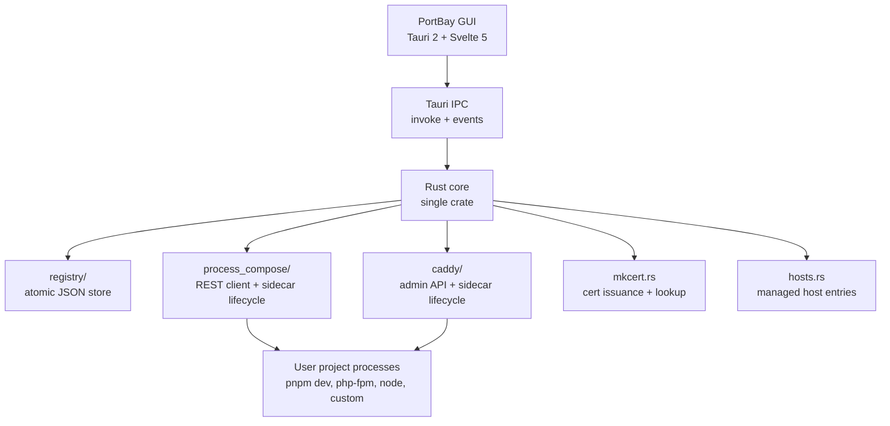

# Architecture

PortBay is a native local development control plane built with Tauri 2, Rust, Svelte 5, Process Compose, Caddy, and mkcert.

## Component Choices

| Component | Choice | Reason |
| --- | --- | --- |
| Desktop shell | Tauri 2 | Small installer, Rust-native core, cross-platform path. |
| Frontend | Svelte 5 + Tailwind 4 | Compiler-first reactivity and low runtime overhead. |
| Core language | Rust | Single binary, strong process-control ergonomics, Tauri-native. |
| Process daemon | Process Compose | Mature process supervision, health checks, logs, REST API. |
| Reverse proxy | Caddy 2 | Runtime admin API, HTTPS-first model, simpler config than nginx. |
| Local TLS | mkcert | Standard local CA and certificate flow. |
| Storage | JSON registry | Auditable, portable, sufficient for one-user local state. |

## Data Flow

1. The user edits projects in the GUI or CLI.
2. Rust validates and writes the registry.
3. PortBay regenerates Process Compose and Caddy state.
4. Sidecars start, stop, route, and log project processes.
5. Status changes flow back to the GUI through IPC events.

## Runtime Files

| Path | Purpose |
| --- | --- |
| `~/Library/Application Support/PortBay/registry.json` | Project registry |
| `~/Library/Application Support/PortBay/runtime.json` | Live sidecar port assignments |
| `~/Library/Application Support/PortBay/certs/<project-id>/` | mkcert-issued certificates |
| `~/Library/Application Support/PortBay/logs/<project-id>.log` | Per-project logs |
| `~/Library/Application Support/PortBay/process-compose.yaml` | Generated Process Compose config |
| `~/Library/Application Support/PortBay/caddy/autosave.json` | Caddy-managed autosave |
| `/etc/hosts` | PortBay-managed host block where applicable |

## Phase Status

| Phase | Status |
| --- | --- |
| Phase 0 — validation spikes | Done |
| Phase 1 — headless core | Done |
| Phase 2 — GUI MVP | In progress |
| Phase 3 — UX polish, error handling, onboarding | In progress |
| Phase 4 — open-source release readiness | In progress |
| Phase 5 — Linux and Windows | Deferred |

The raw engineering note remains in `docs/ARCHITECTURE.md` for contributors who need source-level detail.
