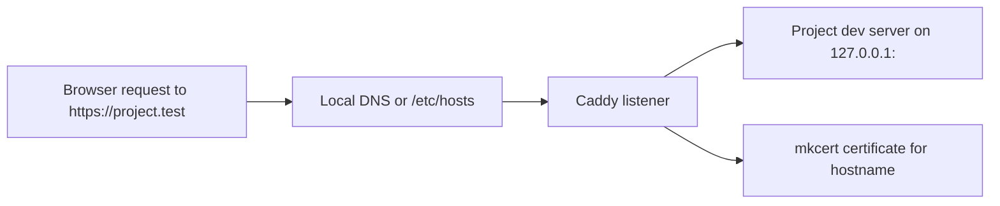

# Caddy And HTTPS

PortBay uses Caddy as the reverse proxy. The app generates route configuration from the registry and applies it through Caddy’s admin API.

## Routing Model



## Certificate Model

mkcert issues local certificates per project. PortBay stores them under:

```text
~/Library/Application Support/PortBay/certs/<project-id>/
```

If a browser rejects a local certificate, verify the mkcert root is installed and that the project hostname matches the certificate Caddy is serving.

## When Caddy Is Out Of Sync

1. Open Services and refresh sidecar status.
2. Restart Caddy.
3. Reconcile hostnames.
4. Restart the affected project.
5. If the route still fails, inspect the project’s registry record and generated Caddy autosave file.

## Useful Signals

| Symptom | Likely cause | Next action |
| --- | --- | --- |
| Browser cannot resolve hostname | DNS or `/etc/hosts` missing the hostname | Reconcile hosts or restart dnsmasq. |
| Browser connects but returns 502 | Project process is not listening on the configured port | Check logs and the start command. |
| Browser warns about certificate | mkcert root or project certificate mismatch | Reissue certs and restart Caddy. |
| App reports `CADDY_FAILURE` | Caddy admin API rejected or missed the route update | Restart Caddy, then retry the project action. |
