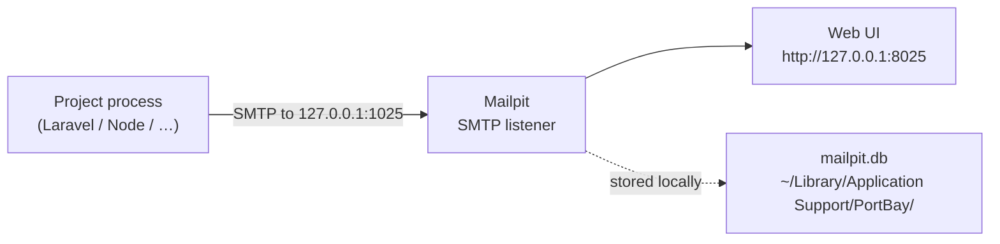

# Mailpit — Local Mail Catcher

Mailpit is a local SMTP sink bundled with PortBay. It receives all outgoing mail from your projects during development and lets you inspect each message in a web UI. Nothing leaves the machine: both listeners bind to `127.0.0.1` only.

## How It Works



PortBay spawns Mailpit on app start (best-effort — if the binary is missing, everything else still works). When Mailpit is running, PortBay injects SMTP defaults into every project process so mail-sending code routes to the local catcher without any `.env` changes.

## Ports

| Service | Default | Fallback |
| --- | --- | --- |
| SMTP | `1025` | Next free port up to +16 from default |
| Web UI | `8025` | Next free port up to +16 from default |

Both are loopback-only (`127.0.0.1`). The actual ports in use are shown on the Mailpit sidecar card in Services: `smtp :1025 · ui :8025`.

## Quickstart

1. Open PortBay. If Mailpit is bundled and available, it starts automatically.
2. Check the **Services** tab — the Mailpit card shows `smtp :1025 · ui :8025` when running.
3. Click **Open inbox** on the card. Your browser opens `http://127.0.0.1:8025`.
4. Send an email from your project (trigger a password reset, a welcome mail, etc.).
5. The message appears in the Mailpit inbox within seconds.

If the card shows `not installed`, install the binary:

```sh
brew install mailpit
```

Then restart PortBay.

## Environment Variable Injection

When Mailpit is running, PortBay automatically injects the following environment variables into every project process before it starts:

```sh
MAIL_HOST=127.0.0.1
MAIL_PORT=1025
MAIL_FROM_ADDRESS=hello@example.local
MAIL_MAILER=smtp
MAIL_ENCRYPTION=null
```

These defaults match the naming Laravel and Symfony expect out of the box. You do not need to edit `.env` to enable local mail catching — the variables are set in the process environment at launch time by PortBay.

**Project-level env overrides win.** If your project has an explicit `MAIL_HOST` entry (in the project's env editor or in a `.env` file that your dev server reads directly), that value takes precedence over the injected default. PortBay only sets the var when your project has not already set it.

## Per-Project Setup (Optional)

The env injection applies to all projects. If you want to explicitly associate Mailpit with a specific project (for documentation purposes or future per-project routing), add it to the project's Services list:

1. Open the project detail panel.
2. Go to **Advanced**.
3. Under **Services**, toggle **mailpit**.

This tags the project in the registry. It does not change the current injection behavior — all running projects already receive the env vars when Mailpit is up.

## Framework Configuration

For cases where you need to configure your framework's mailer directly (bypassing env injection, or running outside PortBay), point it at the Mailpit SMTP listener:

### Laravel

```ini
# .env
MAIL_MAILER=smtp
MAIL_HOST=127.0.0.1
MAIL_PORT=1025
MAIL_USERNAME=null
MAIL_PASSWORD=null
MAIL_ENCRYPTION=null
MAIL_FROM_ADDRESS=hello@example.local
MAIL_FROM_NAME="${APP_NAME}"
```

### Symfony (Mailer component)

```ini
# .env.local
MAILER_DSN=smtp://127.0.0.1:1025
```

### Node (Nodemailer)

```js
const transporter = nodemailer.createTransport({
  host: '127.0.0.1',
  port: 1025,
  secure: false,
});
```

### Node (generic SMTP env vars)

```sh
SMTP_HOST=127.0.0.1
SMTP_PORT=1025
```

## Message Storage

Mailpit stores messages in a SQLite database at:

```text
~/Library/Application Support/PortBay/mailpit.db
```

PortBay starts Mailpit with `--max 1000`. When the inbox exceeds 1000 messages, older messages are automatically removed. The store persists across app restarts — messages from previous sessions remain until they age out or you delete them from the web UI.

## Reference

### Sidecar States

The Mailpit card in Services reports one of four states:

| State | Meaning |
| --- | --- |
| Running | Sidecar is up. Detail line shows the actual ports. |
| Stopped | Binary is on PATH but the process is not running. Restart PortBay. |
| Not installed | No `mailpit` binary found (bundled or PATH). Install it with Homebrew or your Linux package manager, or use a bundle that includes the sidecar. |
| Unreachable | Process may be in an error state. Check the app logs or restart PortBay. |

### Startup Behavior

Mailpit starts before the first reconcile tick. The initial process-compose YAML is generated without `MAIL_*` vars; the first reconcile tick after Mailpit comes up regenerates the YAML with the injections and restarts the process manager once. Projects started before that first tick do not receive the vars until they are restarted.

### Flags PortBay Passes to Mailpit

```sh
mailpit \
  --smtp 127.0.0.1:1025 \
  --listen 127.0.0.1:8025 \
  --db-file ~/Library/Application Support/PortBay/mailpit.db \
  --max 1000
```

The web UI is not opened automatically on startup. Use the **Open inbox** button on the sidecar card, or navigate to `http://127.0.0.1:8025` directly.
